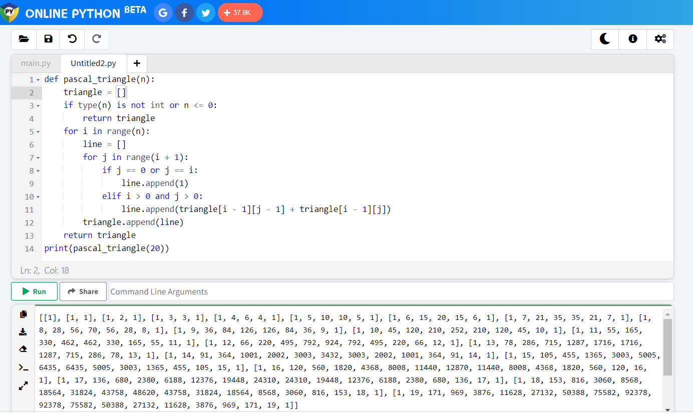

# Pascal's Triangle

This project contains tasks for working module with Pascal's triangle as a challenge.

## Tasks

+ [x] 0. **Pascal's Triangle** [0-pascal_triangle.py](0-pascal_triangle.py) contains a function `def pascal_triangle(n):` that returns a list of lists of integers representing the Pascal's triangle of `n`:
  + Returns an empty list if `n <= 0`.
  + You can assume `n` will be always an integer.

## Explanation

This function takes an integer n as input and returns a list of lists representing the first n rows of Pascal's triangle. The function first initializes an empty list triangle which will be used to store the rows of the triangle. It then checks if n is a positive integer, and if it's not, it returns the empty list. Otherwise, it iterates over the range 0 to n - 1 and generates each row of the triangle.

For each row, it initializes an empty list line which will be used to store the values in the row. It then iterates over the range 0 to i, where i is the current row number, and calculates the value for each element in the row. If the element is the first or last element in the row, it is set to 1. Otherwise, it is calculated by adding the value of the element in the previous row at the same position and the element in the previous row at the position before that. The completed row is then appended to the triangle list.

Finally, the triangle list is returned as the result of the function.

